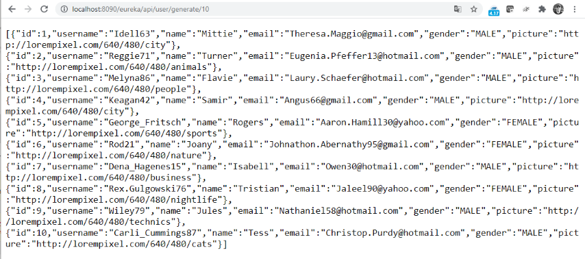
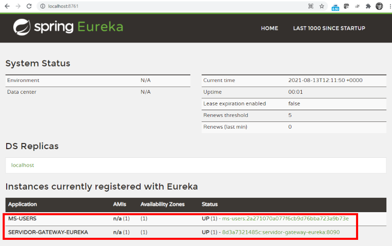

# Spring Cloud User Application

This toy project focus in show how to use:

* Spring Boot as driver technology for REST API.
* JPA for data access for persistence API.
* The cloud by a proof of concept about the [Spring Cloud Netflix](https://spring.io/projects/spring-cloud-netflix) ecosystem. 
* Keep all of that automated with Maven
* Engage together in a sample deployment on a scalable infraestructure (Docker with multiple instances of the service)

Please find bellow all the information to understand this structure, how to package and launch. Hope you enjoy it, please tell me!

## Project Structure
The project folder contains:

* **servidor-directorio-eureka**: Spring boot module for the Eureka Discovery Server (only one instance is need for this purpose, please see `applications.properties` for more detail). If started, it is available on port `8761` as Spring Cloud standard claim.
* **servidor-gateway-eureka**: Spring boot module for the Gateway Server (only one instance is need for this purpose, please see `applications.properties` for more detail). If started, it is available on port `8090` as Spring Cloud stardars claims. In order to get any error, it is nice to started it on second place in order to registry it self on the Eureka Server. If don't it will recover as soon at the Discovery Server is in place.
* **ms-users**: Spring boot module with the main service. Please run in third place if you don't want to have any errors. Its port is random and it is possible to launch more than one instance (keep in mind that the database on memory will be not shared (a file database is needed), the purpose is just to show a scalable microservice approach). It will connect to the Discovery/Gateway. All the load will be balanced to all of the ms-users instances, you don't need to know the port to call them. All the connections and balance are driven by the gateway.
* **docker-compose.yml**: Docker compose file, it defines all the containers and images needed for a Docker deploy (please find more instructions on how to use it later on this document).
* **pom.xml**: POM of the parent project.
* **README.md**: This document.

Inside of every subproject a classic project structure was followed. Please see `pom.xml` and `Dockerfile` subfolders on each module for more details about the dependencies and requirements of the Docker containers.

## Data model and databases
As is more convenient for development and test purposes I have used H2 in memory database. Also, as it is explained bellow, for the Docker approach it was substituded by postgres.

The data model is driven by JPA according to this definition:

```java
public class User {
	public enum Gender { MALE, FEMALE }
	
	@Id @GeneratedValue(strategy = GenerationType.IDENTITY) 
	private Long id;
	
	@Column(unique=true) @NotNull
	private String username;
	
	private String name;
	
	private String email;
	
	@Enumerated(EnumType.STRING)
	private Gender gender;
	
	private String picture;
}
```

## API REST
The API published deliver this services:

* /api/user/ (GET): return the list of all users.
* /api/puser/{page=?&size=?} (GET): return the list of all users (paginated version).
* /api/user/{username}/ (GET): return a single user.
* /api/user/ (POST): create a user.
* /api/user/{username}/ (PUT): update the information of a single user.
* /api/user/{username}/ (DELETE) : delete a single user.
* /api/user/generate/{number}/ (GET): generate n number of random users.

## `ms-users` application
The core of the project is this submodule. Created as a Spring Boot Application but with all the necessary annotations for a correct deployment as a Spring Cloud service. 

Both the Discovery and Gateway can have also multiple instances but not in this example, they are not configured for that. The `ms-users` application can have more instances, this how it works:

* The dev environment (please see `application-dev.properties`): in this environment it possible to launch this application 'stand-alone' without the need of the Discovery and Gateway services. The port in this case is fix to `9000` just to do more easy to test it from any external tool. if It is used on your machine, please change manually on the properties file. The H2 database works in memory, so because the port is fix and the database is not going to be shared has no sense to launch more than one instance. For this environment the H2 database is auto-populated with 2 foo rows just.
* The production environment (please see `application.properties`) : the port is random and the H2 database is not populated. To launch more instances is possible, in theory, buy have no sense because of the H2 database (each one is going to have is own).
* The docker environment (please see `application-docker.properties`) : the port is random and the H2 database is substituted by Postgres using a docker container, so to launch more instances is possible because all of them are going to shared by JDBC service exposed by the docker db container. Also the name of the Discovery Server is fix to the name of the Discovery container in order to be able to get to it during runtime. Please see `docker-compose.yml` for how it is configured and the docker instructions to launch more than one instance.

## Testing with postman
I have use postman to test the API-REST, please find the configuration on this [public link](https://www.getpostman.com/collections/a265d0104e17ed573d10) if you would like to use it on your own.

## Build the application
 All the project was developed using STS and it is designed for a Java 11 environment, so you will need:

* Java 11
* An up to date Maven
* An up to date Docker version (with docker-compose command available to run the `docker-compose.yml` version 2).

I have use a Windows machine, I hope every thing is in place and this commands are the same on a linux environment. To build the packages, please type inside `spring-cloud-app` folder:

`mvn clean package`

## Running from command line with Maven 

As the project needs the Discovery Server, the Gateway and the Service itself you will need to use the -T option for maven to create parallel launches. In my test Maven has kept the order of launch (as typed on the main POM). If it doesn't work maybe you have to launch it separately on the order mentioned before. To manage the 4 projects in parallel (parent, eureka, gateway, service) please type from `spring-cloud-app` folder, it works for me:

`mvn -T 4 spring-boot:run`

Maybe it is going to take a while for all the services to startup and link to each other, it could be normal that the gateway is in place but it doesn't reach the service until a few seconds.

## Running with Docker

After the mvn package construction, you can use the `docker-compose` command to launch the configuration defined on `docker-compose.yml`. To build images, create containers and start it in background:

`docker-compose build`

`docker-compose up -d`

To stop the containers, remove them from Docker and remove the connected networks from it:

`docker-compose down`

To start the container scalling the ms-user service (in example 3 instances) please type:

`docker-compose up --scale ms-users=3 -d`

As it happens with Maven, it is going to take a while for all the services to startup and link to each other, even more if several instances of the user service are launched.

## Check if Spring Cloud is on
To check the Eureka Discovery Server is up please type in your brownser:

[http://localhost:8761/](http://localhost:8761/)

It will show the Eureka main page with all the information of the instance, including all the information of the registred services. After the Gateway and the MS-USERS is on place you will find it as Applications.

## User End Point
The application will be available on when it is used as stand-alone application:

[http://localhost:8090/api/user](http://localhost:8090/api/user)

If loaded on Spring Cloud context the url is:

[http://localhost:8090/eureka/api/user](http://localhost:8090/eureka/api/user)

## Swagger
If you want to see the services documentation and test it using Swagger please use:

http://localhost:8090/swagger-ui/index.html](http://localhost:8090/swagger-ui/index.html)

When it is launched from Spring Cloud:

[http://localhost:8090/eureka/swagger-ui/index.html](http://localhost:8090/eureka/swagger-ui/index.html)

## Screenshoots
### REST-API call results


### Eureka Discovery Server Dashboard (one service instance and gateway service)

### Eureka Discovery Server Dashboard (three instances and gateway service)

### Docker (3 service instances, discovery server, gateway server and postgress db server)

